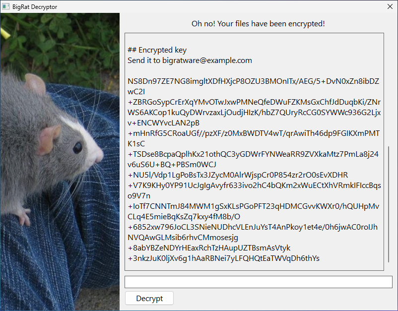

# Decryption

<table><tr>
<td></td>
<td></td>
</tr></table>

## Bigratware Decryptor

After encrypting user's files, Bigratware will install itself into `%appdata%\bigratware\bigratware.exe` and create shortcuts to itself in the start menu, startup folder and on desktop. When the user opens it, Bigratware Decryptor window will show a window with information about what happened and what to do to decrypt files.

Bigratware doesn't have a built-in mechanism of communication with a server, so transferring the keys back and forth between the client and attacker (vendor) needs to be done in another channel. Same applies to a payment, if needed. Bigratware doesn't know nor care about money.

## The process

In the Decryptor info text, there is an RSA-encrypted key-nonce pair that the user has to send to the vendor (see the second screenshot above). The vendor then using `bigratware-toolchain decrypt-pair` command, decrypts the pair using a private RSA key, and sends it back to the user. The user then pastes it into the Decryptor and clicks "Decrypt". If everything goes well, all files should be decrypted.

## Decrypting a single file

If the user doesn't believe or wants to make sure that the vendor can indeed decrypt their files (they appear like normal PNGs after all), they can send a single Bigratware-encrypted file to the vendor. The vendor then can decrypt it with their private RSA key by using the `bigratware-toolchain decrypt-file` command.
